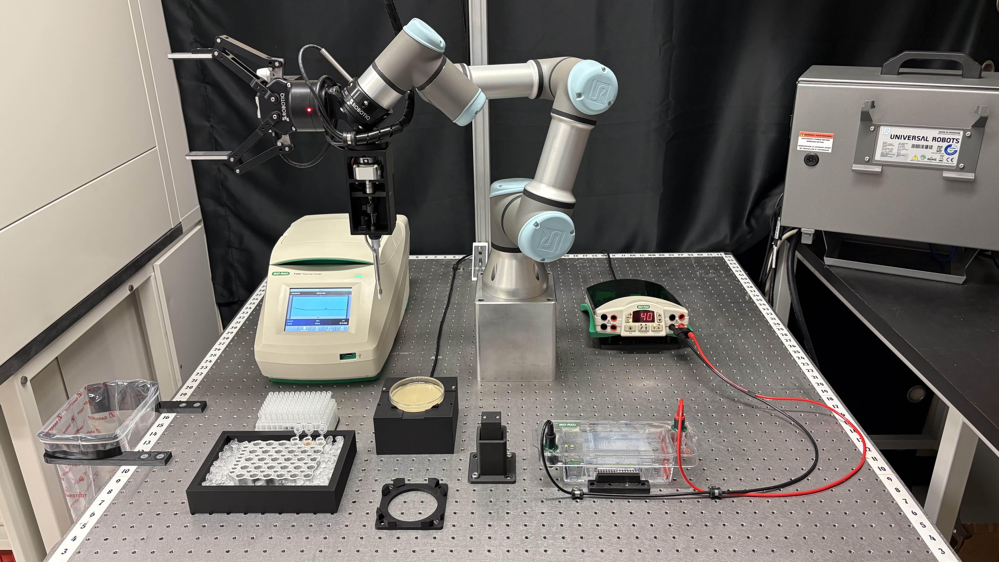

# Biology Cobot Platform

This repository provides the open-source implementation of the **Biology Cobot System**, a versatile, modular, and affordable collaborative robot platform for biological laboratory automation.



It contains instructions for setting up all required ROS packages and configuration files to reproduce the protocols described in our manuscript.

The platform automates multi-step molecular biology workflows:
- PCR Amplification and Validation (*Protocol Alpha*)
- Gibson Assembly and Bacterial Transformation (*Protocol Beta*)
- Colony Picking and Construct Validation (*Protocol Gamma*)


## Hardware

The Biology Cobot platform is built from accessible, commercially available, and custom-fabricated components.  


| Component              | Model / Description              | Approx. Cost (USD) |
|------------------------|----------------------------------|--------------------|
| **Robot**              | UR3 (Universal Robots)           | $20,000            |
| **Force–Torque Sensor**| 6-axis, end-effector mounted     | –                  |
| **Gripper**            | Versatile 2-finger gripper       | –                  |
| **Custom Pipette**     | Electronically controlled, dual-function | –           |
| **Optical Table**      | 1 m × 1 m stainless steel with 1-inch grid | –         |
| **3D Printer**         | Bambu Lab                        | $1,200             |

*Note: Costs are approximate and may vary depending on suppliers and configurations.*  


## Software

The Biology Cobot platform relies on the **Robot Operating System (ROS)** and associated motion planning frameworks.  
The reference implementation has been developed and tested on:  

- **Ubuntu 20.04 LTS**  
- **ROS Noetic** (ROS 1)

### Required Packages

| Package                        | Purpose                                    | Notes                           |
|--------------------------------|--------------------------------------------|---------------------------------|
| **MoveIt**                     | Motion planning and execution              | Standard ROS motion planning framework |
| **MoveIt Task Constructor**    | Task-level manipulation pipeline           | Sequencing multi-step lab tasks |
| **UR Driver**                  | Communication with the UR3 robot           | [`universal_robot` or `ur_robot_driver`] |
| **Cartesian Controllers**      | Precise Cartesian motions                  | For pipetting and lab protocols |
| **Robotiq / Generic Gripper**  | Gripper control interface                  | Replace with your hardware-specific package |
| **Force–Torque Sensor Drivers**| Wrench feedback integration                | Vendor-specific driver package |
| **Custom Pipette Package**     | Electronic micropipette control             | Included in this repository     |


## Installation

To simplify installation, this repository includes a setup script for Ubuntu 20.04:

```bash
# this may take a while
$ ./ubuntu-20.04-setup.bash

# don't forget to source your current terminal
$ source ~/.bashrc

```
